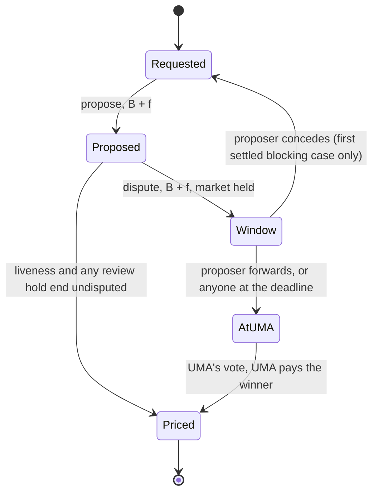

# Intendment for optimistic oracles: disputes that settle never pay the oracle

Design document v0.5, 2026-10-06. Status: design with its decisions taken (section 13); a prototype of the module in `oracle/` that passes unit tests and fork tests against Polymarket's and UMA's deployed contracts on Polygon; the backtest in `backtest/`; first venue Polymarket. Polymarket Protocol V2 started canary markets on 2026-10-05 and moves net-new markets to V2 on 2026-11-02; from then on every new market resolves through V2's OracleAggregator, and this design plugs into it as a reporter module. It replaces stage 4 of design v0.9 and the insertion study `oracle-insertion-polymarket.md`, whose concession paid UMA exactly what a lost vote would and therefore saved time and nothing else. It adapts the spine of design v0.9 (S1 to S21) to optimistic oracles; where it cites an S-rule, it means that rule read for an oracle. v0.2 folded in the protections of RFC 002 (draft, PR #13), which proposes a parallel structure for the same goal; section 15 says what was taken from it, what was not, and why. v0.3 led with the V2 module and aligned the text with the prototype; v0.4 took the open decisions and recorded the fork tests; v0.5 folds an external review of v0.4 and the module, and the corrections the published backtest found; section 16 lists every change from v0.4.

Sources. UMA's contract behaviour is quoted from `UMAprotocol/protocol` (`OptimisticOracleV2.sol`, `OptimisticOracleV3.sol`) and from UMA's managed-oracle repository (`ManagedOptimisticOracleV2.sol`); Polymarket's from `Polymarket/uma-ctf-adapter` (v4) and Polymarket's V2 oracle (`polymarket-v2-external`, `src/oracle`); RFC 002 from PR #13 at `c5185e96`. Measurements are on-chain reads at Polygon block 94,791,008 and Ethereum block 26,100,438 and log scans to 2026-10-01; the dispute dataset and the scripts behind sections 1 and 6 are in `backtest/` (section 12, A4). Judgments are marked as such.

## 0. The claim

Over the 90 days to 2026-10-01 Polymarket's disputes paid UMA's Store 529,625 USDC.e. Most disputes are on markets with a 500 USDC.e bond, where each side posts 750 and UMA takes 500 of the 1,500 at the moment of the dispute, whoever is right. The vote then takes a median 78 hours, and in four resolved disputes out of five it finds the proposal wrong; in about half the proposal simply came too early.

This layer puts a short window between a dispute and UMA. In it the proposer may concede, or, where no market waits on the case, the disputer may withdraw. The side that ends the case forfeits its bond: half goes to the other side, exactly what the vote would have paid it, and half to the venue, exactly what UMA burns today. It keeps its final fee, because UMA decided nothing. Anyone may also put their own stake behind a live proposal: a proposer who gives up removes only itself, and the answer stands as long as someone is willing to defend it. A settled dispute pays UMA nothing and frees both bonds at once. An unsettled dispute reaches UMA unchanged: the same question, evaluated at the same moment, the same parties of record, the same bonds, and UMA pays the winner directly as it does today. Markets resolve as they do today, except that a market blocked on a wrong proposal resolves a few hours after the dispute instead of after the vote.

Measured against those 90 days (section 6): between 249,250 and 417,875 USDC.e of UMA's take sat on disputes the layer could have settled, depending on how many losing sides end their cases themselves. Of that, the final fees, 135,500 to 230,750, would have stayed with the sides that ended their cases, and the burned halves, 113,750 to 187,125, would have gone to Polymarket's reward vault instead of UMA's Store; at September's rate the venue's part is about 630,000 a year. Between 542 and 923 of the 1,187 votes would not have been needed, and 25 markets that waited a median 78 hours on a second proposal the vote then found wrong, together 106.6 million USDC of lifetime volume, would have reopened within the hour of a concession. It is not a capital story: all proposers together kept about 600,000 locked on average, worth about 7,400 a quarter at 5%. The case to Polymarket: UMA's economics without UMA's vote whenever the parties already agree on who was wrong, the burn paid to Polymarket instead of UMA, and big markets that stop waiting days on proposals that were simply wrong.

## 1. Today, measured

| | value | source |
|---|---|---|
| where new markets resolve | UmaCtfAdapter v4 `0x6507…f2A7` (binary) and NegRisk UmaCtfAdapter v4 `0x69c4…5f24`, both on UMA's MOOV2 `0x2C03…58B1`; Polymarket's V2 oracle uses UMA as a reporter module since 2026-08-27 | adapter `optimisticOracle()`, MOOV2 requester whitelist |
| requests, September 2026 | 955,595 | MOOV2 `RequestPrice` logs |
| bond, final fee | bond 250 USDC.e on 87.9% of requests, 500 on 12.1%; UMA's final fee 250 USDC.e since 2023-07-11; a proposer posts 500 or 750 | request settings; `Store.computeFinalFee(USDC.e)` |
| reward | 0.8 USDC.e on 75.7% of requests; 904,741 USDC.e paid in September over 776,500 undisputed settlements | settlement payouts |
| liveness | 15 minutes on 36.1% of proposals, 2 hours on 36.1%, 30 minutes on 21.8%; proposal to settlement median 31 minutes | `ProposePrice` expiries |
| settlement | only two Risk Labs resolver addresses may settle on MOOV2 since 2026-02-24; a flagged proposal can be held in open-ended review | MOOV2 `onlyResolver`, role logs |
| disputes, 90 days to 2026-10-01 | 1,187 of 1,845,259 proposals (0.064%): 1,126 first disputes, after which the market resets, and 61 second disputes, on which the market waits for the vote; 143 self-disputes; 84% of settled disputes since MOOV2 went live, and 61% of those resolved in these 90 days, were on 500-bond markets, against 12.1% of requests | `DisputePrice` logs |
| who was right | the proposal was wrong in 886 of 1,097 resolved disputes (81%); the vote answered "too early" on 567 of them | settlement prices |
| UMA's take | 529,625 USDC.e in the 90 days, which matches the Store's USDC.e inflows; proposers paid 374,750 of the non-self part by losing, disputers 58,125; 172,375 from non-self disputes since 2026-09-01 | Store payments |
| rewards | 2,673,876 USDC.e paid to proposers in the 90 days, Polymarket's own resolution spend | undisputed settlements |
| time | undisputed proposal to settlement median 34.5 min; dispute to settlement median 78.4 h (p95 168.8 h); a market on its first dispute resolves from the reset request a median 2.4 h after the dispute; second disputes held their markets a median 77.9 h | dispute and settlement logs |
| capital | all proposers' locked stake: time-weighted mean 598,774, p95 1.71 million, max 3.50 million; about 7,400 of interest a quarter at 5% | request states |
| Protocol V2 | canary markets from 2026-10-05, net-new markets on V2 from 2026-11-02; resolution through the OracleAggregator `0x0A0a…4a87` "with pluggable modules for connecting to different resolution sources such as UMA, Chainlink and any future oracle" | Polymarket's announcement of 2026-10-05 |
| V2 canary configuration, 2026-10-04 to 10-05 | 395 requests: 390 reported by Chainlink with no liveness, 5 by UMA's reporter module with a 300-second aggregator window; on all 395 the aggregator's disputer module and arbitrator are the dead address `0x…dEaD`, and a Polymarket finalizer finalizes | `RequestInitialized`, `ReporterModuleAdded`, `DisputerModuleAdded` logs |

Three facts shape the design. UMA's final fee equals the usual bond, so the oracle's take is two thirds to three quarters of what the loser posts, not a rounding error. Settlement on MOOV2 is permissioned and its proposer whitelist is curated by Risk Labs, so a layer that wants to work without UMA's consent has to carry those controls itself (section 4.7). And proposers already dispute their own proposals to take them back: 57 honest self-corrections in the 90 days, each paying UMA 375 or 500 for a vote nobody needed (move Q4).

## 2. Where the money goes in a dispute today

Notation: bond B, final fee f. A proposer and a disputer each post B + f. OOv2, and MOOV2 which inherits it, burn half the loser's bond, `floor(B/2)`, and pay the Store f + B/2 in the dispute transaction. The reward is refunded to the requester on dispute, because `setEventBased` also sets `refundOnDispute`.

| outcome | proposer | disputer | UMA's Store | at B = 500, f = 250 |
|---|---|---|---|---|
| undisputed | gets back B + f, plus the reward | | nothing | |
| the vote says the proposer was right | net +B/2 | net −(B + f) | f + B/2 | proposer +250, disputer −750, UMA 500 |
| the vote says the disputer was right | net −(B + f) | net +B/2 | f + B/2 | proposer −750, disputer +250, UMA 500 |

UMA's comment on the burn gives its purpose: to make delay "proportionally more expensive ... even if the proposer and disputer are the same party". A layer that removes the burn must price that delay itself (section 5.3).

## 3. Requirements

| id | requirement | from |
|---|---|---|
| O1 | Settlement never decides a market. A market's answer comes only from a proposal that survived a full liveness undisputed, or from UMA's vote. A settlement can retract a proposal; it can never make one stand. | S7: the traders are not at the table |
| O2 | UMA is paid exactly for the cases it decides. | the claim |
| O3 | Silence escalates. A party who does nothing gets today's outcome, reaching UMA at most one window later, and only on a case that blocks a market. | S1 |
| O4 | Delay is never free. Every settled case pays a non-party charge, and settled cases that block a market are bounded per question. | S4; UMA's burn |
| O5 | Each side can end a case alone on terms the other side cannot refuse, so nobody is held up. | design v0.9, ceilings |
| O6 | Being wrong stays expensive. A proposal caught by someone else costs its proposer its bond, and anything a proposer can do with a second wallet of its own costs at least what UMA burns today, half the bond. | S4, S6, and section 5.1's measurement |
| O7 | The disputer's dispute is its opening offer: it cannot send the case to UMA before the deadline. The proposer may at any time. | S2 |
| O8 | Forwarding is faithful: an unsettled case reaches UMA with the same question, the same evaluation time, the same parties of record and the same bonds. | design v0.9, forward first |
| O9 | The layer never refuses a dispute and never breaks the interface the venue calls. | S14 |
| O10 | Payouts are claimable credits; no transition depends on a party accepting a transfer. | S15 |
| O11 | The party of record is the wallet that called. | S21 |
| O12 | The venue's controls carry over: proposer whitelist, per-request bond and liveness, and a settlement gate with review holds. | section 1 |
| O13 | One small, non-upgradeable contract per venue, with the venue's parameters fixed at deployment. | S17 |
| O14 | Adoption needs the venue and nobody else. UMA's and Risk Labs' consent is not needed, and existing markets are untouched. | adoption |
| O15 | Every move changes only the caller's own stake. Giving up removes the caller, never another backer or the answer that backer defends. | RFC 002 |
| O16 | "Too early", no answer and oracle failure are different states, and none of them produces an answer by itself. A market's result is reported once. | RFC 002 |

## 4. The mechanism

### 4.1 Where it sits

The dispute has to happen on the layer, because a dispute on UMA's oracle pays the Store in the same transaction. The proposal therefore has to happen on the layer too.

**A reporter module in Polymarket's V2 OracleAggregator.** The aggregator separates who reports, who disputes and who arbitrates into modules that Polymarket's operator chooses request by request. UMA is plugged in today as a reporter: UMA's own managed oracle runs the bonded proposal and dispute game, and UMA's module relays its settled answer to the aggregator as one reporter vote. The layer takes the same slot. Its module hosts the bonded game, with the settlement window inside it, and reports the answer the game produces:

- **Registration.** The operator calls the aggregator's `initializeRequest` with the module as the request's reporter. The aggregator stores the request's configuration and then calls the module's `initializeReporterModule(eventId, data)`, where the data lists, per condition, the request id, the bond, the liveness, the proposer reward and the question for UMA's voters. The module reads the market type back from the aggregator and supports binary and incremental neg-risk markets; atomic neg-risk needs a multiple-choice question at UMA and is not supported yet. The reward is earmarked from a budget the venue funds in advance. A question longer than UMA's limit on ancillary data, less the case tag a forward adds, is refused here, because UMA would refuse its forward.
- **Reporting.** The aggregator counts one vote per reporter module per request, so the module reports exactly once: the proposal that survives its liveness, or UMA's answer to a blocking case. A report that fails, for instance because the aggregator is paused, is retried by anyone.
- **The venue's gate.** After the module's vote the aggregator runs its own liveness and only the request's finalizer may finalize, which is where Polymarket keeps its review today. The aggregator's disputer and arbitrator slots stay as the operator sets them, the dead address on every canary request.
- **Rule updates** reach the module through `updateRules`, which announces them. A forwarded case's question is frozen, because UMA keys the request by it, so its voters need a pointer from it to Polymarket's clarification history; Polymarket's own UMA module passes updates on to UMA instead. The pointer is open (13, decision 13).

**Behind the v4 adapter, for markets created before 2026-11-02.** The v4 adapter takes its oracle's address at construction, so a new deployment of its code can point at a contract that speaks the oracle's interface: the **front**, the same core behind OOv2's requester-, proposer- and disputer-facing functions. That route serves the remaining v1 volume only and is not built in the prototype.

Three other insertion points were examined and rejected. UMA's V3 oracle with an escalation manager: V3 pays the Store anyway, and its code says so, "the oracle fee is sent to the Store contract, even if the escalation manager is used to arbitrate disputes". A change to MOOV2: its upgrades need a 2-of-2 Safe whose other owner is the Safe that runs the resolver role, and the change would take UMA's fee away. Forwarding into MOOV2: its `proposePriceFor` requires both the named proposer and the caller to be on Risk Labs' proposer whitelist, and its `requestPrice` requires the requester whitelist; the legacy OOv2 reaches the same vote with nobody's permission (section 4.6).

### 4.2 Cases

Every dispute opens a **case**. The core escrows both stakes, B + f from each side, and opens a **window** of length W; its end is the case's **deadline**. Until the deadline the case can end three ways: the proposer concedes, the disputer withdraws where allowed, or the proposer sends it to UMA. From the deadline anyone may send it to UMA. Nothing sends it automatically: a keeper does, whether the disputer, the venue or anyone, as keepers also settle proposals, resolve forwarded cases and retry reports (13, decision 15). A case sent to UMA is **forwarded** and leaves the core's control; UMA's vote decides it and UMA pays the winner.

### 4.3 Blocking and non-blocking cases

Polymarket resets a question on its first dispute: it asks the oracle again with a new timestamp, and the disputed request continues at UMA only for the bonds. A dispute on a request that has already been reset is different: the market waits for UMA's vote. The module keeps exactly those semantics, holding the reset itself, and calls the two kinds of case **non-blocking** and **blocking**. Behind the v4 adapter a venue profile would tell them apart by reading the adapter's own reset flag for the question.

- **Non-blocking case.** The reset happens in the dispute transaction, as today: the module opens a new proposal round at once (behind the adapter the core would call `priceDisputed` at once). The market proceeds exactly as today, and the case concerns only the bonds. Concession and withdrawal are both open.
- **Blocking case.** The core holds the market for the window. If the proposer concedes and nobody co-backs its answer (4.9), the proposal is retracted and the request reopens for a new proposal with a fresh liveness; behind the adapter, the adapter is never told. If the case is forwarded, the market waits for UMA's vote as today; behind the adapter the core calls `priceDisputed` in the forwarding transaction. Withdrawal is closed on blocking cases (section 5.4). At most M settled blocking cases per question, M = 1 by default; after that, any further dispute on the question is forwarded in the dispute transaction, without a window. If UMA refuses that forward, the dispute still stands and holds the market: the case can only go to UMA, anyone may retry the forward, and the emergency path of section 8 applies after the grace period.

### 4.4 Moves

| id | move | who | when | money | effect |
|---|---|---|---|---|---|
| Q1 | register | the venue's operator, through the aggregator | when the market is set up | the reward, earmarked from the venue's budget | a request |
| Q2 | propose | a whitelisted proposer | as today | B + f escrowed | liveness starts |
| Q3 | settle undisputed | anyone | after the liveness | B + f + reward credited to the proposer of record; every co-backer's stake becomes claimable | the module reports the answer; the aggregator's own window and finalizer follow |
| Q4 | retract | the proposer of record | while its proposal is live and undisputed | the proposer is credited B + f − δB; δB to the non-party recipient | without a co-backer: proposal retracted, the request reopens; with one: the earliest co-backer becomes the proposer of record and the liveness runs on (4.9) |
| B1 | co-back | anyone | from the proposal until it is forwarded or ends | B + f escrowed behind the proposal's answer, at the f recorded with the proposal | a standby stake in a queue (4.9) |
| D1 | dispute | anyone | within the liveness | B + f escrowed, at the f recorded with the proposal; the reward returns to the requester when the market learns of the dispute, at once on a non-blocking case and at forwarding on a blocking one; a concession leaves it for the next proposal | a case opens with deadline now + W; non-blocking: reset now; blocking: market held; blocking after M settled cases: forwarded at once, or held for UMA alone if UMA refuses |
| C1 | concede | the proposer of record | before forwarding | without a co-backer: the proposer is credited f, the disputer B + f + (1 − δ)B, the non-party recipient δB; with one: the proposer is credited B + f − δB and the non-party recipient δB | without a co-backer: proposal retracted, and a blocking request reopens; with one: the earliest co-backer becomes the proposer of record and the case runs on to the same deadline (4.9) |
| W1 | withdraw | the disputer | before forwarding; non-blocking cases only | the disputer is credited f; the proposer B + f + (1 − δ)B; the non-party recipient δB | dispute retracted |
| E1 | forward | the proposer of record at any time; anyone from the deadline | before a concession or withdrawal | the proposer of record's and the disputer's stakes move to UMA's legacy OOv2 (section 4.6), which pays the Store f + B/2; every other co-backer's stake becomes claimable | UMA's vote decides; blocking: the market waits for it |
| E2 | resolve a forwarded case | anyone | after UMA's vote | UMA pays the winner directly | blocking: the request has UMA's answer |
| K1 | claim | any creditor | any time | the creditor's balance to an address of its choice | the only transfer to a party |

### 4.5 Payouts

| outcome | proposer, net | disputer, net | UMA's Store | non-party | stakes free after |
|---|---|---|---|---|---|
| vote: proposer right | +B/2 | −(B + f) | f + B/2 | 0 | the vote, ~78 h |
| vote: disputer right | −(B + f) | +B/2 | f + B/2 | 0 | the vote, ~78 h |
| concession | −B | +(1 − δ)B | 0 | δB | the concession |
| withdrawal | +(1 − δ)B | −B | 0 | δB | the withdrawal |
| retraction | −δB | | 0 | δB | the retraction |
| concession or retraction while a co-backer remains | −δB | 0; the case runs on against the co-backer | 0 | δB | the leaving stake, at once |

A retraction costs what a dispute from the proposer's own second wallet followed by a concession would cost, because under S4 that is what it is; pricing it higher would only send proposers through the second wallet. Today the same self-correction costs f + B/2 through a self-dispute and a vote.

At the bond most disputes carry, B = 500 with f = 250, and δ = 1/2:

| outcome | proposer | disputer | UMA | venue |
|---|---|---|---|---|
| today, the vote finds the proposer wrong | −750, 78 hours later | +250, 78 hours later | +500 | 0 |
| a concession | −500, at once | +250, at once | 0 | +250 |
| a retraction before any dispute | −250, at once | | 0 | +250 |

The disputer receives exactly what winning the vote pays it today, 78 hours sooner. The final fee, 250, returns to the side that paid it, because UMA decided nothing. The half of the bond UMA burns today, 250, goes to the venue instead of to UMA's Store. At the 250 tier the same concession is −250, +125, 0 and +125, against −500, +125 and +375 to UMA today.

### 4.6 Forwarding

A forwarded case must reach the vote as if the layer had not existed (O8). The core is the requester of record on the legacy OOv2 at `0xeE3A…7c24`, which shares MOOV2's vote (both send disputes through the same OracleChildTunnel to VotingV2), and does, in one transaction:

1. `requestPrice` for the venue's identifier and the question, tagged with the case id so that every forwarded request is unique (`<question>,intendmentCase:<id>`), with reward 0, the request timestamp set to the **original proposal time**, and not event-based. For event-based requests OOv2 asks the vote about the moment of the proposal (`_getTimestampForDvmRequest` returns expiration minus liveness); a request keyed at the original proposal time reproduces that moment exactly. An event-based request created at the deadline would make the vote evaluate a later moment, at which a premature proposal may have become true.
2. `setBond(B)` and the shortest liveness OOv2 accepts; the liveness never runs, because the next two calls happen in the same transaction.
3. `proposePriceFor(proposer, …)` and `disputePriceFor(disputer, …)`, paying each B + f from escrow. OOv2 pulls the stake from the caller and records the named proposer and disputer, so UMA's interfaces show the real parties and settlement pays the winner directly.
4. For a blocking case: behind the adapter, the `priceDisputed` callback; in the module, nothing until E2.

Settlement on the legacy OOv2 is permissionless. Disputes and co-backing stake the final fee recorded with the proposal, so no call to UMA stands between a challenger and its case, and UMA's current fee is read only when a case is forwarded. If UMA's final fee rose between the stakes and the forward, the caller of the forward pays the rise, the party that wants the vote; a fee that fell is credited back to each party. UMA pays the winner directly, so the layer cannot repay a rise out of the loser's share; the final fee for USDC.e has not changed since 2023.

### 4.7 The venue's controls

MOOV2 gives Polymarket three controls that the layer keeps (O12):

- **Proposer whitelist.** The module accepts a proposal only from an address on the venue's list. The list can be UMA's own default proposer whitelist, `0x9F35…c463`, read in place, so Risk Labs' curation carries over without Risk Labs doing anything, or a list the venue keeps.
- **Bond and liveness per request**, set in the registration.
- **A review gate.** Short liveness is safe on MOOV2 because only resolvers settle and a flagged proposal can be held for human review. In V2 the aggregator provides the gate after the module reports: its own liveness, its finalizer, its per-market pause and its admin's `resolveResult`. The module therefore needs no settler role of its own. The gate stops a wrong answer from paying traders; it does not hold the proposer's stake, which the module releases when the proposal settles, before the finalizer acts. Holding the stake through the review would need settlement to wait for finalization, which the module does not do (13, decision 14).

The bond currency stays USDC.e, the currency UMA accepts and Polymarket's bonds use today, although V2 trades in pUSD: a forwarded case must reach UMA in a currency on UMA's collateral whitelist.

### 4.8 The blocking path



A non-blocking case has the same window but does not hold the market: the reset goes out with the dispute.

### 4.9 Co-backing

RFC 002's correction applies to a serial case too: a proposer giving up must not erase an answer that someone else is willing to defend. Under v0.1 a concession retracted the proposal, and anyone who agreed with it had to propose again, with a fresh liveness, and on a blocking request after M was spent straight into the vote.

- **Anyone may co-back a live proposal** (B1) by escrowing the same stake, B + f, behind its answer, from the proposal until it is forwarded or ends. Co-backers queue in order of arrival.
- **A concession or retraction removes the caller's stake only.** If a co-backer remains, the earliest one becomes the proposer of record: the case keeps its deadline, a liveness keeps running, a blocking request does not reopen, and M is not consumed. The leaving proposer pays the non-party charge δB, the price of any self-correction (5.1), and recovers the rest. Only when the last stake behind the answer gives up does the case end as in v0.1, with the counterparty paid its court win.
- **A co-backer is at risk only once it is the proposer of record.** When the case is forwarded, the proposer of record's stake goes to UMA with the disputer's, and every other co-backer's stake becomes claimable at once. When a proposal settles undisputed, the proposer of record receives the reward and every co-backer's stake becomes claimable.
- **Co-backing pays nothing, and a standby stake stays until the proposal closes.** It is protection for whoever holds a position on the answer, not income; a reward would invite filling the queue for the reward, and leaving at will would let a co-backer show support it then withdraws.
- **No transition iterates over co-backers.** The queue is popped one stake at a time, and the stakes left behind are released by one flag that each co-backer claims against (S15).

Two wallets of one owner gain nothing from it: conceding into one's own co-backer pays δB and leaves the same case standing. A co-backer of a wrong answer pays like a proposer once it reaches the front.

The disputer's side needs no co-backing: on a blocking case the disputer cannot withdraw (5.4), and on a non-blocking one the market has already moved on, so nobody else depends on the dispute. Co-backing is open to anyone by default, because the people it protects are the traders holding the answer; a venue that wants every proposer of record to be on its whitelist restricts co-backing to the same list.

### 4.10 Money buckets

Every unit of the core's cash sits in exactly one bucket, and every move changes the buckets atomically:

```text
core cash = stakes behind live proposals and open cases (proposers, co-backers, disputers)
          + rewards earmarked for registered requests
          + the reward budget not yet earmarked
          + claimable credits
```

There is no pot, no reserve and no subsidy: apart from the reward budget the venue funds, the core never holds money that is not owed to a named party or to the non-party recipient. Forwarding moves both case stakes to UMA's oracle in the forwarding transaction. No move releases a stake while it is committed to a case, and no credit exists before the money behind it has arrived. A forwarded case is fully funded by construction, because both stakes were escrowed at the proposal and the dispute; the only top-up is a rise in UMA's final fee (4.6).

### 4.11 Too early, no answer and failure

Three different situations, kept apart:

- **Too early.** Only UMA's vote can say it, on a forwarded case. The venue's own rule then applies: Polymarket's adapter opens a new request with a new evaluation time and a fresh liveness. No party can declare it for everyone, and the core never infers it from silence.
- **No answer.** A request with no live proposal stays open, as today. It never defaults to NO or to a split.
- **Failure.** UMA not accepting a forwarded case leads to the emergency path of section 8: stakes are returned and a blocking market goes to the venue's manual resolution. A failure never produces an answer.

A market's result is reported once. Stake claims, credits and stale callbacks never reopen it, and nothing a party does after the report changes what traders are paid.

## 5. Why the prices are what they are

### 5.1 The default: today's court outcome for everyone, without the vote

Going to the vote costs the two parties f + B/2 between them, whatever the vote says, plus about 78 hours of waiting. A settlement can split that saving three ways: to the side that ends the case, which lowers the price of being wrong; to the other side, which raises the reward for catching a wrong proposal; or to a non-party, which prices self-dealing.

The default is design v0.9's stage-1a rule, the counterparty receives exactly its court win, with the non-party charge set to UMA's own burn, δ = 1/2. In money every position equals today's court outcome except one: the side that ends the case keeps the final fee, the one charge that pays for a vote that never happened. The disputer of a wrong proposal receives B/2 as the vote would pay it; the proposer loses its bond B, not B + f; the venue receives the B/2 that UMA's Store receives today. Settlement still pays for the side that ends the case: a proposer that knows it was wrong saves its final fee, 250, and is done in minutes instead of 78 hours, so it concedes. Under common beliefs a proposer concedes when it puts its own chance of being wrong above 75% at the 500 tier and 60% at the 250 tier; a disputer withdraws under the same condition.

Why the charge is UMA's burn and not something smaller (section 5.3 says why it exists at all): two wallets of one owner can dispute and concede to each other, so any self-correction, retraction included, costs a proposer exactly δB, and so does every self-dealing loop. Nearly half of all disputes are premature proposals, made in a race among whitelisted proposers for rewards of 0.8 to 5. A racer that catches its own premature proposal pays f + B/2 today, 500 at the 500 tier; at δ = 1/2 it pays 250; at δ = 1/10 it would pay 50, and early proposals would be nearly free whenever the proposer notices first. A premature proposal that someone else catches costs the bond, against bond and final fee today. Lowering δ is still a legitimate venue choice if it wants more of the saving to go to the disputer, but the venue then leans on its whitelist's accuracy rule, which should count every concession and retraction as an inaccurate proposal, to keep racing in check.

Negotiated prices, an ask from the side that would receive the forfeited bond and a bid from the side that would pay it, follow design v0.9 section 3.1 and are stage B. They move the conceder's loss between δB + B/2 and its court loss, B + f; at δ = 1/2 the band is exactly the final fee.

### 5.2 Why the disputer cannot forward early

The dispute is the disputer's offer, "concede or face the vote". A disputer who could forward at once would deny the proposer its exit at no cost to itself beyond waiting. That is free griefing (R2), so the disputer waits for the deadline. A proposer forwarding early rejects the offer, which is any receiver's right; a confident proposer on a blocking case forwards at once, and the market waits no longer than today.

### 5.3 The non-party charge replaces UMA's burn

Two wallets of one owner can propose, dispute and settle among themselves; the forfeited bond then moves between their own pockets. Without a charge that loop holds a market back for gas: a non-blocking dispute buys one reset, a blocking concession one more liveness. UMA prices the loop with the final fee and the burn, 500 a time at the 500 tier, all of it to the Store. The layer prices it with δB, paid to a recipient that is neither party, and bounds blocking loops to M per question. The charge is a price on the state itself (S4): no rule keyed on addresses or counts can replace it.

δ is a policy dial with a natural setting. At δ = 1/2 a self-dealing loop costs the burn, B/2, as today but without the final fee; the winner receives today's court win; and the burned half goes to the venue instead of UMA. Lower values move part of the burn to the disputer and make self-correction and self-dealing cheaper by the same amount (5.1). Decided: δ = 1/2, paid to the venue's reward vault (section 13).

### 5.4 Why the disputer cannot withdraw from a blocking case

On a blocking case a withdrawal would leave the disputed proposal standing for a market. A wrong proposer holding a position could then buy the only disputer off the case. Restarting the liveness after a withdrawal would give others a second chance, but attention after a dispute is thin, because everyone watching assumed the dispute had it covered. v0.1 therefore opens withdrawal only on non-blocking cases, where the market has already moved to a new request and a withdrawal moves nothing but bonds. A disputer who was wrong on a blocking case gets today's outcome.

### 5.5 What a concession can and cannot do to a market

A concession retracts a proposal; the market still needs a proposal that survives a full liveness, or UMA's vote. A proposer bribed to concede a correct proposal on a blocking case reopens the request; the next correct proposal can be disputed again, and that dispute goes straight to UMA because M is spent. The briber has bought the delay a dispute alone buys today, and paid more for it; and if anyone co-backs the answer, the bribed concession removes only the bribed proposer and buys nothing (4.9). Nobody can buy an answer.

## 6. What it changes for Polymarket

A backtest over the 90 days to 2026-10-01 (blocks 89,554,537 to 94,738,439), replaying every dispute under the rules of section 4. The dataset and the scripts are in `backtest/`, where `scenarios.py` recomputes every number below. Self-disputes are counted apart. Each scenario assumes a different share of losing sides ends its case itself; the vote's own answer says who was wrong.

| scenario | cases settled | UMA's take not paid | of which final fees kept by the side ending the case | of which the burn paid to the venue | votes not needed | blocked markets reopened within the hour of a concession |
|---|---|---|---|---|---|---|
| only proposals the vote called "too early" are conceded | 542 | 249,250 (47%) | 135,500 | 113,750 | 542 | 12 markets, 946 market-hours, 11.8 million lifetime volume |
| every proposal the vote found wrong is conceded | 831 | 374,750 (71%) | 207,750 | 167,000 | 831 | 25 markets, 1,999 market-hours, 106.6 million lifetime volume |
| as above, and every wrong disputer on a non-blocking case withdraws | 923 | 417,875 (79%) | 230,750 | 187,125 | 923 | as above |

Self-corrections, the 57 honest self-disputes, would have been retractions: 25,000 of UMA's take not paid, of which 14,250 kept by the proposers and 10,750 to the venue, and 57 votes fewer. (A further 86 self-disputes by one proposer on requests whose liveness had been set to a billion seconds are a configuration accident and are left out.)

At the September run rate the middle scenario is worth about 1.45 million a year: 0.82 million of final fees kept by the side that ended its case and 0.63 million of burn paid to the venue, against rewards of about 11 million a year. The largest blocked market in the window, "Will Ronaldo Cry at the World Cup?" with 89.2 million of lifetime volume, waited 74 hours for a vote that found its second proposal wrong; whether its proposer would have conceded is not knowable from the chain, and the scenarios say only what was possible.

What the backtest does not show: the stake released early is worth about 500 USDC.e of interest over the quarter, because disputes are rare and short-lived proposals dominate the lock. Beyond the burn it receives, Polymarket's own spend changes only if it chooses: lower dispute losses for proposers make room for lower rewards, which the venue sets.

## 7. What it costs, and who pays

| who | cost | size |
|---|---|---|
| UMA | its take on every settled case | 249,250 to 417,875 USDC.e a quarter in section 6's scenarios; UMA keeps every case it decides, and its voters see only genuine disagreements |
| markets | an unsettled blocking case reaches UMA up to W later | one hour against a vote of about 78; UMA votes in two-day rounds, so in about one case in 48 the hour moves the vote a round later, and on average it still costs about the hour; a confident proposer forwards at once |
| wrong proposers | none in money: conceding costs the bond, as losing costs the bond plus the final fee today; catching one's own mistake costs half the bond instead of a self-dispute's 500 | |
| the venue | a new adapter deployment or a module registration, front-end support for cases, review-hold operations, and an audited contract that holds stakes for the window | one non-upgradeable contract |

## 8. Attack catalogue

| attack | outcome |
|---|---|
| self-dispute and settle to delay a market | priced at δB per settled case and bounded to M blocking cases per question; the first dispute's reset is today's behaviour |
| race to propose early and concede if caught | caught by someone else: the bond, 500 against 750 today at the 500 tier; caught by the proposer itself: the burn, 250 against 500 today; at a smaller δ self-correction would be nearly free (5.1) |
| propose early and retract if the event goes the other way | a retraction costs the burn, δB, the same as a dispute and concession between the proposer's own wallets; the whitelist's accuracy rule counts it as an inaccurate proposal |
| bribe the proposer to concede a correct proposal on a blocking case | buys one reopen; the next dispute goes to UMA at once; no answer can be bought (5.5) |
| concede a proposal that someone else co-backs, to erase its answer | impossible: the co-backer carries the answer on to the same deadline (4.9) |
| co-back a wrong proposal to keep it alive | the co-backer becomes the proposer of record and pays as a proposer would; if nobody gives up, the answer reaches UMA |
| fill the co-backer queue | each place costs a full stake; no transition iterates over the queue, and the stakes behind are released with one flag |
| bribe the disputer off a blocking case | impossible: no withdrawal on blocking cases (5.4) |
| dispute a correct proposal to make the proposer pay UMA | the disputer cannot forward before the deadline; at the deadline the vote costs the disputer B + f; a confident proposer forwards at once |
| propose prematurely and rely on a late forward to make the proposal true | forwarding keys the vote at the original proposal time (4.6) |
| a silent proposer on a blocking case | the market waits W, then the vote as today |
| front-run an honest dispute with a retraction or a dispute from one's own second wallet | saves the proposer B/2 against conceding to the honest disputer, exactly what a self-dispute saves on UMA today (f + B/2 against a lost vote's B + f); the honest disputer's transaction fails without cost |
| occupy the market with proposals that are retracted before anyone disputes | each retraction costs B/2, and any disputer can dispute the live proposal at any moment of its liveness |
| a proposer off the venue's whitelist | rejected at the proposal; the legacy OOv2 needs no whitelist because the core enforced it |
| front-run a concession with a forward | before the deadline only the proposer can forward; after it the two race, and either outcome is one the proposer could have chosen |
| reverting receivers | payouts are credits (O10) |
| reentrancy through the adapter's reset | the adapter's reset calls back into `requestPrice` and the settings inside `priceDisputed`; the core allows request creation during its own dispute and forward transactions and guards everything else |
| request-key collision on OOv2 | at most one case per request is ever forwarded: a non-blocking request has one case before its reset, a blocking request forwards its first case or, after one settled case, the next; the forwarded request is keyed by the question's ancillary data and that case's proposal time, under the core as requester |
| UMA changes the final fee between proposal and forward | the caller of the forward pays a rise, being the party that wants the vote; a fall is credited back to each party (4.6) |
| a review used to stall a market | the review is the venue's own and sits in the aggregator after the module reports, as it does for UMA's module today (4.7); the module adds no hold of its own |
| UMA stops accepting the layer's forwarded requests | forward first: anyone retries; after a grace period and a fresh failed attempt in the same transaction, each side's stake is returned in full and a blocking market goes to the venue's manual resolution (the v4 adapter's flag and `resolveManually`, the V2 aggregator's admin `resolveResult`); a disclosed failure, the oracle analogue of design v0.9's emergency lapse |
| UMA refuses the forward of a dispute made after M is spent | the dispute stands and holds the market; only a forward can end it, which anyone may retry, and the emergency path follows after the grace period |
| UMA's fee lookup fails while a proposal is live | disputes still open, because they stake the fee recorded with the proposal; only forwarding waits for the lookup |

## 9. Passivity

| who acts | case | outcome | versus today |
|---|---|---|---|
| nobody | non-blocking | the market resets at the dispute; the stakes reach the vote when someone forwards | same market; the stakes wait one window longer before the vote |
| nobody | blocking | the market waits W, then the vote | W longer, rarely a voting round longer (7) |
| a wrong proposer concedes | non-blocking | both stakes free at once; UMA paid nothing | same market; the proposer saves its final fee, the disputer receives its court win 78 hours earlier, the venue receives the burn |
| a wrong proposer concedes | blocking | the request reopens; a new proposal resolves the market after one liveness | the market resolves hours after the dispute instead of after the vote |
| a wrong disputer withdraws | non-blocking | both stakes free at once | mirrored |
| a confident proposer forwards at once | either | today's outcome | identical |
| a proposer catches its own mistake before anyone disputes | any | it retracts; the request reopens at once | today it self-disputes and pays UMA for a vote, about 78 hours |
| a proposer gives up while someone co-backs its answer | any | the co-backer carries the answer on; the market is not reopened | today nobody can give up; the vote decides about 78 hours later |

## 10. Capital: stakes that are not all cash

Early release shortens how long a disputed stake is locked. It does not change how much a proposer holds while its proposals are live, one full B + f per live proposal. On Polymarket that is not where money is lost: all proposers together held a time-weighted mean of 598,774 USDC.e, about 7,400 of interest a quarter at 5%, and the largest proposer, with 28.7% of all proposals, peaked at 1.06 million while earning 592,633 in rewards over the quarter. Capital is not a binding constraint for Polymarket's proposers, and the pitch does not claim it. Proposer credit belongs to venues where bonds are large and long-lived.

**Proposer credit (stage C, for large-bond venues).** A whitelisted proposer posts a prepayment u·(B + f) per proposal from a bond account at the core; the rest is a promise recorded there. On a dispute the proposer must top the case up to B + f before the deadline. A proposer that does not is deemed to concede: the disputer is paid from the prepayment, the unpaid remainder is recorded as the proposer's debt, and the venue's whitelist policy treats an unpaid debt as grounds for removal. For a credited case silence concedes, and that is the price a proposer accepts for credit, disclosed in the venue's policy. Capital need falls from one full stake per live proposal to u of a stake per live proposal plus one full stake per live dispute: at u = 1/10 and today's dispute rate, about a tenth of today's lock. The whitelist supplies the external identity that RFC 001 section 5.6 says credit needs, because a whitelisted proposer has something to lose outside the core.

What it accepts: against a defaulting proposer the disputer's immediate award is the prepayment, so the venue caps credit per proposer and requires full stakes above a market size. An underwriter that guarantees the promise for a premium, with recourse to the whitelisted entity, removes that gap; that is the reserve-underwriting track of RFC 001 section 5.8, with its own threat model, and it needs a jurisdiction-specific legal review before anything launches.

## 11. Rules tried and rejected

| rule | why it fell |
|---|---|
| a concession that pays UMA what a lost vote would (v0.9 stage 4) | settlement then saves time and nothing else; the parties carry UMA's share for a vote that never happens |
| a small non-party charge, such as δ = 1/10 | two wallets make any self-correction cost only δB, so premature proposals become nearly free to take back whenever the proposer notices first (5.1) |
| a retraction priced at the full bond | inert: a proposer disputes from its own second wallet and concedes for δB instead (S4) |
| UMA's V3 oracle with an escalation manager | V3 pays the Store on every dispute even when the manager decides (4.1) |
| forwarding into MOOV2 | needs the core on Risk Labs' proposer whitelist and the venue's requester whitelist (4.1) |
| holding the market on non-blocking disputes | adds W to every first dispute whose proposer stays silent, where the reset costs nothing today |
| free settlement | lets two wallets of one owner hold a market back for gas (5.3) |
| a settlement that resolves the market | the traders are not at the table (O1) |
| disputer withdrawal on blocking cases | a channel to buy the only disputer off a wrong proposal (5.4) |
| more resets inside the layer, decided by a count | changes the market's semantics and adds a liveness to every genuinely contested market; M = 1 settled blocking case gives the same relief on wrong proposals |
| forwarding with an event-based request at the deadline | the vote would evaluate a later moment than the proposal (4.6) |
| a penalty pot shared by the backers of the final answer (RFC 002) | backing both answers from two wallets lets the owner collect its own penalty; only a recipient outside the case prices self-dealing (15) |
| a concession that retracts an answer others are defending (v0.1) | lets one bribed or mistaken proposer erase an answer; replaced by co-backing (4.9) |

## 12. Plan

The work is ordered by what the pitch must show: that the mechanism is complete, that it runs against Polymarket's real contracts, and what it would have saved on Polymarket's real history.

| stage | deliverable | what it proves | gate | status at v0.4 |
|---|---|---|---|---|
| A1 | this design, independently reviewed, with the review folded into the next version | the mechanism holds up to an independent reviewer | review folded | an external review of v0.4 and the module, folded into v0.5 |
| A2 | the core's state machine and accounting, including the co-backing queue and the money buckets, as structured specification data, rendered and validated in CI like spec 0.5 | every state has a named caller and a terminal; money balances on every path | spec checks green | open |
| A3 | an executable model with integer accounting, the invariants of section 14, and the traces of sections 8, 9 and 14 as tests | the payout tables and attack outcomes hold transition by transition | traces green | open; the prototype's unit tests cover the payout tables and the money buckets |
| A4 | section 6's backtest, published with its dataset and scripts, extended back to MOOV2's launch | UMA's take returned, votes avoided, market-hours saved, under stated settlement rates | reproducible from chain data | done for the 90 days in `backtest/`; the extension back to MOOV2's launch is open |
| A5 | the module for V2 in Solidity, the core and its V2 shell, with unit, fuzz and money-bucket tests; the v4-adapter front only if Polymarket wants the remaining v1 volume | the contract implements the design | external audit before any money | prototype with 23 unit tests in `oracle/`, hardened after the review: a dispute stands when UMA refuses its forward, and no call to UMA comes before a dispute is recorded; not audited |
| A6 | Polygon fork tests against the deployed contracts: the V2 aggregator with the module registered as a request's reporter, a wrong first proposal conceded, a wrong second proposal conceded, and an unsettled blocking case forwarded to the real legacy OOv2 with the vote's answer delivered through UMA's bridge contract | it works with the venue's real contracts and the money moves as the tables say | fork tests in CI | done: three fork tests, in CI (below) |
| A7 | a one-page pitch with A4's numbers and A6's transcripts: the burn paid to Polymarket, the final fee kept by the parties, votes avoided and blocked markets reopened; no capital claim | the case for a pilot | Polymarket agrees to a pilot on one market category | in preparation |
| B | negotiated prices (asks and bids), other OOv2 requesters through a generic profile | settlement beyond the default | pilot data | after a pilot |
| C | proposer credit (section 10), then underwriting as a research track with a legal review | capital, not just time | the venue's appetite; section 10's numbers | not for Polymarket (13, decision 7) |

A6 ran on a fork of Polygon at block 95,030,000. Nothing was mocked; the tests impersonate only the live role holders: Polymarket's operator, who registered the module as the request's reporter on the deployed OracleAggregator, Polymarket's finalizer, who finalized the module's answer on the deployed BinaryModule, the owner of UMA's proposer whitelist, the bridge's FxChild, and a USDC.e holder that funds the test wallets. A wrong first proposal conceded paid UMA's Store nothing; the proposer's bond went half to the disputer and half to the venue. A wrong second proposal conceded ten minutes after its dispute reopened the market, and the next proposal resolved it without a vote. An unsettled blocking case went to the legacy OOv2 in the dispute transaction: the Store received f + B/2 as today, the vote's answer arrived through UMA's OracleChildTunnel as the bridge delivers it, and UMA paid the winning disputer directly.

Polymarket's V2 canary period, 2026-10-05 to 10-30, is the moment for A7: Polymarket is inviting integrators to its developer channel and weekly office hours. A pilot needs nothing from Polymarket but an operator registering the audited module on the pilot's markets, and nothing in stage A needs UMA or Risk Labs.

## 13. Decisions

| # | decision | decided |
|---|---|---|
| 1 | the default split | the counterparty receives exactly its court win; the side that ends the case keeps its final fee (5.1) |
| 2 | δ and its recipient | one half of the bond, UMA's own burn, to the venue's reward vault |
| 3 | windows, blocking and non-blocking | one hour on a blocking case, where a market waits; four hours on a non-blocking one, where no market waits and a longer window costs only the stakes' time, longer than the median 2.4 hours in which the reset request resolves; both recalibrated in a pilot with the proposers' bots |
| 4 | settled blocking cases per question, M | 1 |
| 5 | disputer withdrawal on blocking cases | closed (5.4) |
| 6 | which shell leads the pitch | the V2 reporter module; the v4 front only on request |
| 6a | bond currency | USDC.e, which UMA accepts; not pUSD |
| 7 | proposer credit | not for Polymarket: its proposers' capital costs about 7,400 a quarter (section 10); kept for large-bond venues |
| 8 | the pitch's headline | UMA's economics without UMA's vote whenever the parties agree who was wrong: the burn goes to Polymarket, the final fee stays with the parties, and blocked markets reopen within the hour of a concession; no capital claim |
| 9 | who builds stage A | built in this repository: the design, the module and its fork tests (A5, A6); an independent review of both before a pilot, and an external audit before the module holds any money |
| 10 | publication | the design, the module, its tests and the backtest are public material; the pitch and its business terms are not |
| 11 | co-backing | allowed from the proposal until it is forwarded or ends; open to anyone by default, restricted to the proposer whitelist if the venue sets the module's flag at deployment; a pilot uses the whitelist; no reward |
| 12 | RFC 002's parallel clock | deferred as the upgrade path, to be taken up if a pilot shows windows being abused (15) |
| 13 | clarifications on forwarded cases | open before a pilot: a pointer in the forwarded question to Polymarket's clarification history (4.1) |
| 14 | the proposer's stake during the venue's review | open before a pilot: released at settlement as now, or held until the aggregator finalizes (4.7) |
| 15 | keepers | open before a pilot: forwarding, settlement, resolution and report retries each need a caller; the venue's existing bots or the module's maintainers (4.2) |

## 14. Invariants and acceptance traces

The model of stage A3 and the contract of A5 must hold these invariants:

1. Only a stake's owner can withdraw it; no move changes another owner's stake (O15).
2. No settlement makes a proposal stand for a market (O1).
3. Settlement holds a market back by at most one window and one reopen per question, and every settled case pays δB to the non-party recipient (O4).
4. Every forwarded case is fully funded at the dispute. At most one forwarded request exists per request on the core, and its question, evaluation time and parties are fixed (O8).
5. Every unit of cash is in exactly one bucket, and no move releases a stake committed to a case (4.10).
6. No transition iterates over co-backers, disputes or credits (S15).
7. Too early, no answer and failure are distinct, and none produces an answer by itself (O16).
8. A market's result is reported once; claims and stale callbacks cannot reopen it.

Traces to implement, several taken from RFC 002:

| trace | required observation |
|---|---|
| the correct answer is NO; another wallet of the YES proposer disputes and the proposer concedes, again and again | the second loop finds M spent and goes to UMA; every loop paid δB; an honest NO proposal is never touched |
| the correct answer is YES; Alice concedes her YES while Carol co-backs it | Carol becomes the proposer of record; YES is not erased; the deadline is unchanged; Bob's dispute continues against Carol |
| ten disputer wallets against one proposal | one case: a proposal can be disputed once |
| a concession and a co-backing in the same block, in both orders | each order yields one defined state |
| a concession and a forward racing at the deadline | either outcome is one the proposer could have chosen |
| UMA's final fee rises between the proposal and the forward | the forwarder pays the rise; a fall is credited back to each party |
| UMA answers "too early", returns a malformed answer, or stops accepting forwards | only the first opens a new request under the adapter's rule; the others are visible failures |
| a premature proposal forwarded at the deadline | the vote evaluates the original proposal time |
| one owner's wallets cycling proposals, disputes, co-backing and concessions | the owner's total cost is at least δB per settled case |
| a reverting recipient, a lost keeper, a stale callback, the adapter's reset reentering | money stays claimable and nothing blocks another party's move |

## 15. Relation to RFC 002

RFC 002 (draft, PR #13) reaches the same verdict on fees: a dispute the parties settle should not pay UMA. It gets there with a different structure. Every market gets a fixed clock: a period in which anyone may back an answer, then a full review. At the deadline a sole answer backed in time wins, and conflicting answers go to UMA once. Its aim is that no pair of wallets can own the only route forward.

What v0.2 takes from it: a party that gives up removes only itself (4.9, O15); money in separate buckets that never mix (4.10); too early, no answer and failure as different states, with a market reported once (4.11, O16); and its acceptance traces (14).

What v0.2 does not take, and why:

- **A fixed clock for every market.** On Polymarket 0.064% of proposals are disputed, and an undisputed market settles a median 34.5 minutes after its proposal. A backing period and a full review on every market would slow the 99.9% to guard against a hold that this design bounds at one window and one reopen per question, priced at half a bond each time, and that the 90-day data shows nobody attempting.
- **A penalty pot for the backers of the final answer.** Two wallets of one owner can back both answers; the losing wallet's penalty then flows to the winning one, and the owner largely pays itself. Only a recipient outside the case prices self-dealing (5.3), which is why the charge goes to the venue.
- **Funding and rewards left open.** In a serial case both stakes are escrowed before a forward is possible, so a forward is always funded (4.10), and the counterparty's reward is the one UMA already pays, its court win, at once. RFC 002's funding and reward gates do not arise.

RFC 002 also states facts this design measured. Its example bond and fee, 500 and 250, are those of 84% of real disputes. Polymarket's markets now run on UMA's managed oracle with adapter v4 rather than the classic contracts it read. And money tied up, which it names as a benefit, is worth about 7,400 a quarter across all of Polymarket's proposers.

RFC 002's parallel clock remains the stronger design against a hold by a pair of wallets. It is the upgrade path if a pilot shows windows being abused, and it maps onto Polymarket's V2 oracle, whose aggregator already sends conflicting reporter results to arbitration.

## 16. What changed from v0.4

| v0.4 | v0.5 | why |
|---|---|---|
| a dispute after M forwarded in its own transaction, and reverted with a refused forward | the dispute stands if UMA refuses; the case can only go to UMA and anyone retries (4.3, 8) | external review: a refused forward erased the dispute, and the proposal could then settle as undisputed |
| the dispute and co-backing stakes priced at UMA's current fee | priced at the fee recorded with the proposal; UMA's fee read only at forwarding (4.4, 4.6, 8) | external review: a failing fee lookup blocked disputes but not settlement |
| any question length | questions too long for UMA's ancillary-data limit refused at registration (4.1) | the likeliest reason for UMA to refuse a forward |
| "delayed by at most one window" | reaching UMA at most one window later; UMA's two-day rounds can move the vote a round (O3, 7, 9) | external review |
| forwarding left implicit | a keeper calls it (4.2; decision 15) | external review |
| voters read clarifications where they read them today | a pointer is needed, and open (4.1; decision 13) | external review: the module only announces rule updates |
| the venue's review as the gate | the gate stops payouts but does not hold the proposer's stake (4.7; decision 14) | external review |
| co-backing open by default | a pilot restricts it to the proposer whitelist (decision 11) | external review |
| 52 honest self-corrections, 22,875 | 57 and 25,000 (1, 6) | the published backtest: the configuration accident is 86 self-disputes, not all 91 of that proposer's |
| "too early" on 589 | on 567 of the window's own disputes (1) | 589 counted every such settlement in the window |
| the backtest's dataset and scripts to be published | in `backtest/` (A4) | published |
